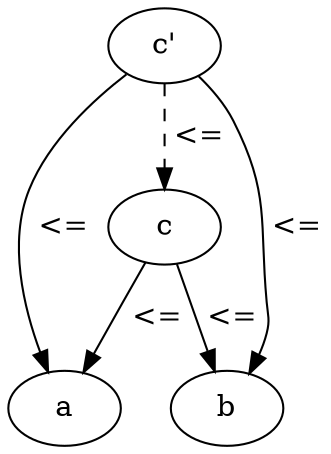
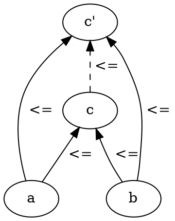
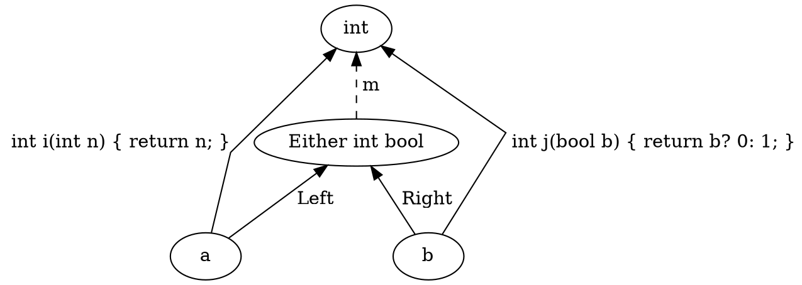

# Category Theory for Programmers Challenges

## 5. Products and Coproducts

### 5.1. Show that the terminal object is unique up to unique isomorphism.

Reversing the arrows gives you a theorem for free, 
so we can take the proof of initial object and simply rewrite in reverse:

Let's suppose that we have two terminal objects t_1 and t_2.
Since t_1 is terminal, there is a unique morphism `f` from t_2 to t_1.
By the same token, since t_2 is terminal, there is a unique morphism `g` from t_1 to t_2.
The composition `g` . `f` must be morphism from t_1 to t_1.
But t_1 is terminal so there can only be one morphism going from t_1 to t_1.
Since we are in a category, we know that there is an identity morphism from t_1 to t_1, and since there is room for only one, that must be it.  Therefore `g` . `f` must be equal to identity.  Similarly `f` . `g` must be equal to identity, because there can be only one morphism from t_2 back to t_2.  This proves that `f` and ``g` must be the inverse of each other.  Therefore any two terminal objects are isomorphic.
That implies that the initial object is unique up to unique isomorphism.

### 5.2. What is a product of two objects in a poset? Hint: Use the universal construction.

The chapter describes a category of sets, but in this question we have a poset category, where objects are elements of the poset and morphisms are relations.

A poset is a partially ordered set.
This is a set of objects that is partially ordered.
A partial order has two rules:

  - `a <= b & b <= c       =>       a <= c`
  - `a <= b & b <= a       =>       a == b`

But not every two objects need to be related, 
because it is not a total order.

Examples include: A set of sets, subtypes and non negative integers ordered by divisibility.

The definition of a product as found in the chapter:

> A product of two objects a and b is the object c equipped with two projections such that for any other object c’ equipped with two projections there is a unique morphism m from c’ to c that factorizes those projections.

If a and b are objects in the poset and there is a object c with two relations:

```
p :: c <= a
q :: c <= b
```

such that for any other object c' equipped with two relations:

```
p' :: c' <= a
q' :: c' <= b
```

there is a unique relation from c' to c that factorizes those relations:

A preorder says that:
```
a <= b & b <= c       =>       a <= c
```

factorization is:
```
p' = p . m
q' = q . m
```

so for relations that would be:
```
p' => p & m
q' => q & m
```

and if we then substitute we get:
```
c' <= a => c <= a & c' <= c
c' <= b => c <= b & c' <= c
```

which means `m` is:
```
c' <= c
```




This means that the product of a poset is the minimum value of its two constituents or rather `c = min(a,b)`, 
because `c` has to be the biggest number `c' <= c` that is smaller than or equal to `a` and `b`.

### 5.3. What is a coproduct of two objects in a poset?

For a coproduct we reverse all the arrows:



```
a <= c & b <= c & c <= c'
```

So `c` is the smallest number that is bigger or equal to `a` and `b`.
This means the coproduct or a poset is the maximum of its two constituents or rather `c = max(a, b)`.


### 5.4. Implement the equivalent of Haskell `Either` as a generic type in your favorite language (other than Haskell).

Go does not have generics and there are many ways to do this incorrectly.
The conventional hack typically followed in Go is to have a tuple with one value null and the other value non null.
This is at least the pattern that is followed for errors and values, which is the most popular either type in Go at least.

In other cases I would recommend a `struct` with two fields and to follow the convention of one being null and the other being non null again and to also have a Case method, which can be used to pattern match and apply a function to the either of the values.

```go
type EitherAorB struct {
  Left *A
  Right *B
}

func NewLeft(a *A) EitherAorB {
  return EitherAorB{Left: a}
}

func NewRight(b *B) EitherAorB {
  return EitherAorB(Right: b)
}

func (e *EitherAorB) Case(f func(a *A) C, g func(b *B) C) C {
  if e.Left != nil {
    return f(e.Left)
  }
  return g(e.Right)
}
```

### 5.5. Show that `Either` is a "better" coproduct than `int` equipped with two injections:

```
int i(int n) { return n; }
int j(bool b) { return b? 0: 1; }
```

> Hint: Define a function

```
int m(Either const & e);
```

> that factorizes i and j.




We can show that `int` can be factorized by `Either`, but not the other way around.

We can define `m` as:

> disclaimer I am not a C++ programmer

```cpp
int m(Either const & e) {
  if (e.tag == isLeft) {
    return e.left;
  }
  return e.right?: 0; 1;
}
```

Here we can see that `m` factorizes the two projections `i` and `j`:

```
i' = m . i
int i(int n) { return n; } = m . Left
n = m (Left n)

j' = m . j
int j(bool b) { return b? 0: 1; } = m . Right
0 = m (Right true)
1 = m (Right false)
```

The other way around does not work, because we can return two answers for zero and one:

```cpp
Either m(int i) {
  if i == 0 {
    return Right(true) || Left(0);
  }
  if i == 1 {
    return Right(false) || Left(1);
  }
  return Left(i);
}
```

### 5.6. Continuing the previous problem: How would you argue that int with the two injections `i` and `j` cannot be "better" than `Either`?

### 5.7. Still continuing: What about these injections?

```
int i(int n) { 
    if (n < 0) return n; 
    return n + 2;
}
int j(bool b) { return b? 0: 1; }
```

### 5.8. Come up with an inferior candidate for a coproduct of `int` and `bool` that cannot be better than `Either` because it allows multiple acceptable morphisms from it to `Either`.
